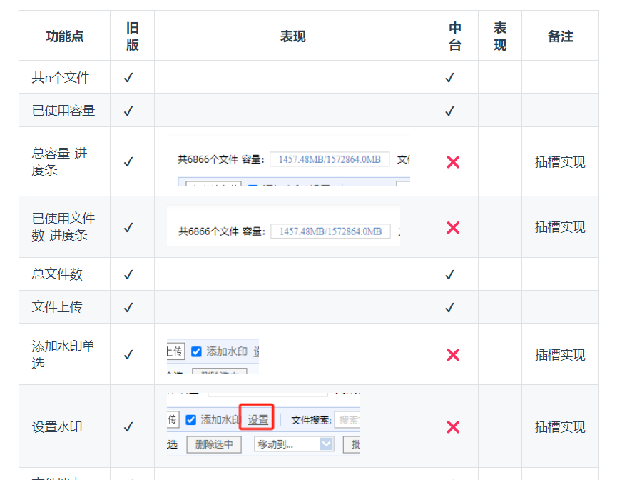
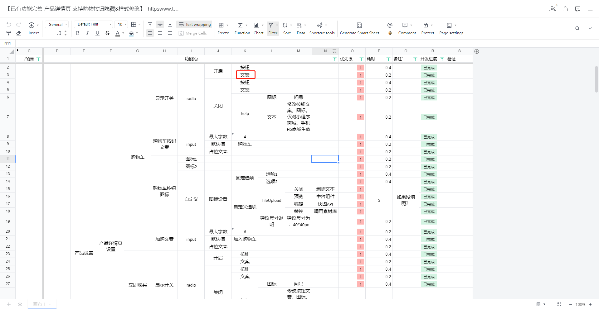
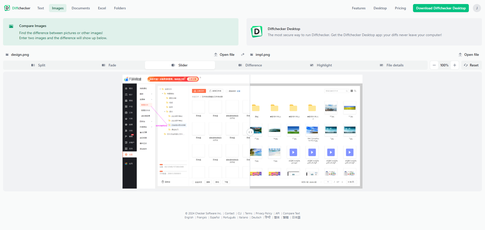
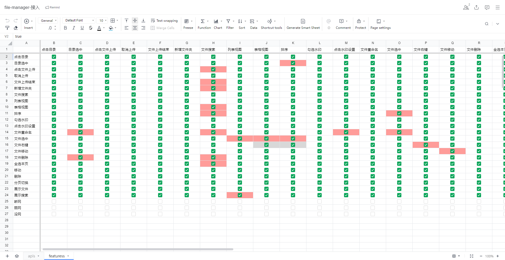

# 需求实现指南

## 背景介绍

针对需求实现经常出现的问题做一个汇总，输出规范减少错误率，重点在于减少，而非100%没有问题，因为0缺陷的情况是非常难以达到的。

## 重构类

例如将A页面重构为B页面，两个页面功能是相同，但具体使用的组件，UI可能不一样，常出现的问题及解决方案如下：

### 迁移功能点遗漏

开发需求前出具功能对比表，对比新旧差异，例如

对于差异的处理方式默认如下

|     | 旧版  | 新版  | 处理策略               |
| --- | --- | --- | ------------------ |
| 功能1 | 有   | 无   | 同步到新版              |
| 功能2 | 无   | 有   | 默认屏蔽入口，无法屏蔽时，丢出来讨论 |

### 性能比之前差

借助第三方工具对性能进行指标打分，逐个优化，对比指标，具体详见 [optimize-page-performance](../notes/optimize-page-performance.md)

## 新需求

### 功能实现遗漏

通过脑图，excel等工具对需求点进行穷举，具体到文本内容，字号大小的粒度，并且研发完成后每个点自己过下。

### 交互行为有争议

- 检查是否和现有业务规范一致？
	- 一致：按照现有规范，
	- 不一致：反之交给PM和设计决定，统一规范，并同步到相关的**业务交互规范文档**和**组件**

### UI不符合设计稿

把设计稿和实现效果截图，通过[在线图片对比工具](https://www.diffchecker.com/image-compare/)进行对比，这样可以快速发现UI细节问题，不用浪费设计师的时间

### 提测缺陷数量多于预期

#### 抄别人的作业

开发功能A的时候，看其他业务是否有开发过，去翻一下他们的需求单和缺陷单，看能否通过历史缺陷单复现缺陷，提前修复。

#### 多花点时间自测

对有交互点的地方，进行穷举，形成一个n x n的表，逐个自测

例如在一个界面有A，B两个按钮有4个情况：
- 单独点击A
- 单独点击B
- 先点击A，再点击B
- 先点击B，再点击A

我们并不需要每个可能的分支都实际操作下，但可以在脑子想下，如果按照表描述的先A后B，有没有可能出问题，然后再去测试，这样子可以提前发现问题。

上图的红色部分，就是通过这样的方式发现缺陷的。一个红色等同1个缺陷，这样自测阶段提前发现22个缺陷。

当然可能存在3个按钮A,B,C，用户可能是在BAC的操作路径下出问题，那是否要考虑呢，其实不需要，从收益的角度看，只测试两个动作的先后顺序，已经能发现大部分的缺陷，再往下收益边际递减。

####  自测时间不足

我们仍然可按照上面的执行，最多删减测试的内容，只要能发现超过1个缺陷，这件事就是有意义的。