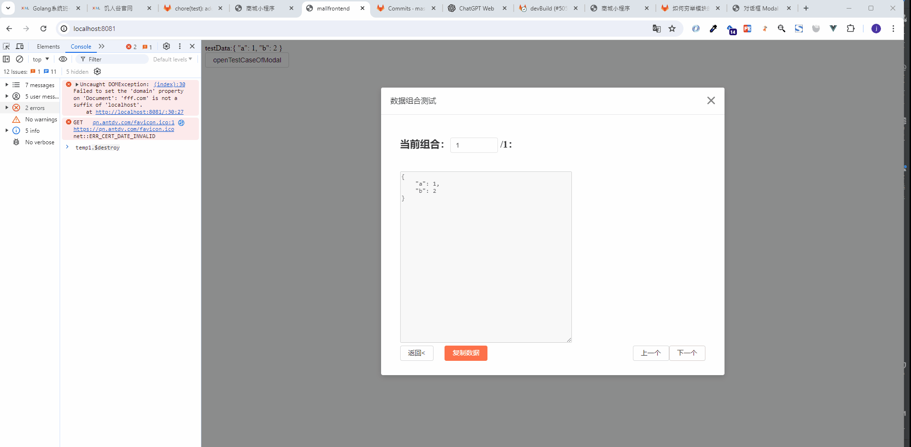

# 测试

## 背景介绍

日常开发中如何去保证代码质量，我们可能有如下几种方式：
- 手工点点点
- 通过代码去测试代码，有且不限于
  - 单元测试
  - 集成测试
  - 自动化测试
  - 其他的一些方式

## 前端项目在使用的测试

- kit：工具函数引入jest做单元测试，验证入参和出参

## 当提交代码触发ci失败时，应当如何处理？

- 首先大概率是你的问题，因为前人是通过了case的。
- 先不要上来就去问测试用例的开发者要怎么处理，尝试自己解决。
- 先自行看下错误报告，看下你改动的方法为什么会失败。
- 大部分情况下不允许注释，跳过用例，因为出错说明其他的业务调用处也会跟着出错。

## 界面测试

假设我们有一个数据如下：
```javascript
var testData = {
    "a": 1, //取值范围：[1,2,3]
    "b": 4, //取值范围：[4, 5, 6]
}
```
a有3种可能，b有3种可能，这里就有3x3=9种组合。如果你手动点点，那么就需要修改9次数据看表现，我们也可以通过@mall/kit提供`getCombinationOfObject`生成测试数据，
```javascript
import { getCombinationOfObject } from "@ustinian-wang/kit";
let dataList = getCombinationOfObject(testData, {
        a: [1, 2,3],
        b: [4, 5, 6]
    });
this.testData = deepAssign( {}, testData, dataList[0] );
```
测试表现：


更多`getCombinationOfObject`的详细用法，详见[传送门](https://ustinian-wang.github.io/kit/global.html#getCombinationOfObject)