## what is it

- system design
	- design
		- requirements
		- architecture
		- interface
	- system components
		- scale
		- security
		- maintainable
- type of frontent system design interviews
	- system design
	- product sense
	- UI architecture
	- machine coding/component design
- things to consider in  frontend system design interviews
	- requirements
		- functional
			- demand/supply: b2c; b2b
			- module level thinking
				- user management
				- help and support
				- payment gayway
				- pricing and subscription
				- production listing
				- cart page
				- account management
			- feture level thinking
		- non-functional
			- mobile/desktop
			- responsive/adaptive
			- internet/location/devices
			- accessibility
			- asset optimization(css, js images)
			- performance(fcp, lcp, tti, web vitials)
			- csr/ssr
			- authentication/authorization
			- securty
			- offline support
			- loggin & monitoring
			- ab test
			- testing
			- internationalization
			- localization
			- versioning
			- pwa
			- ci/cd
			- 
			- 
	- scoping(Auth)
		- demand
		- module
			- product listing
			- cart page
	- tech choices
	- component architecture
		- component hierachy
		- routing
		- data sharing
	- data api & protocols & implementation
		- protocals
			- rest/graphql/sse/rpf
			- json/protocol buffers
		- implementation
			- pagination/infinite scrolls
			- debouceing/throttleing
		- apis
	- data modeling

## component

- Architectural Patterns
	- Iframe
	- Web components
	- Module Federation
	- MicroApps /Route based
- Communication Protocols 
	- long polling
	- ws
	- sse
- Availability
	- offline mode
- Accessibility 
	- keyboard
	- screen
- Consistency
	- css
	- design system
- Credibility & Trust
- Logging & Monitoring
- Databases
	- HTTP Caching
	- In memory caching
	- Apollo Caching
	- State management(Redux，Context)
	- Local storage
	- Session storage
	- Cookie
	- IndexedDB
- Caching
- Security
- Performance & Optimization
	- Assets optimization
	- Delivery option
	- Build assets
	- SSR
	- Service worker
	- -Web Vitals
	- Perceived performance
- Testing

## network

- Lazy loading
	- lazy attribute
	- fetchpriority
		- 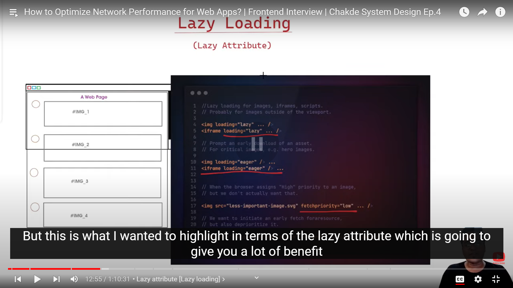
	- intersection observer
		- 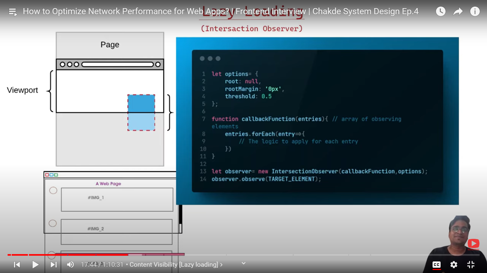
- Loading javascript in async 
	- 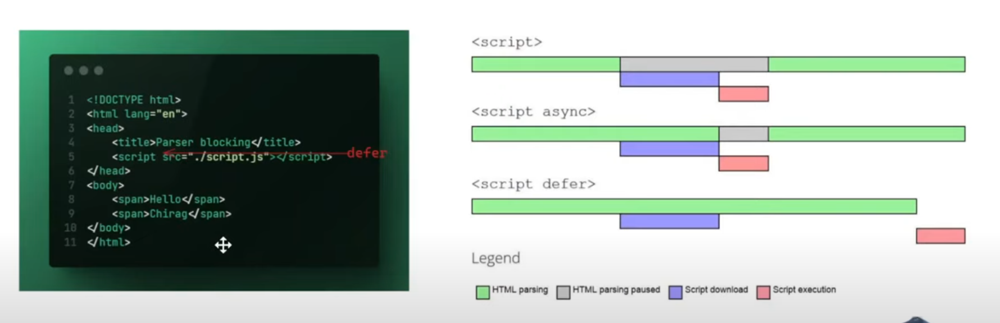
- Content visibility
	- 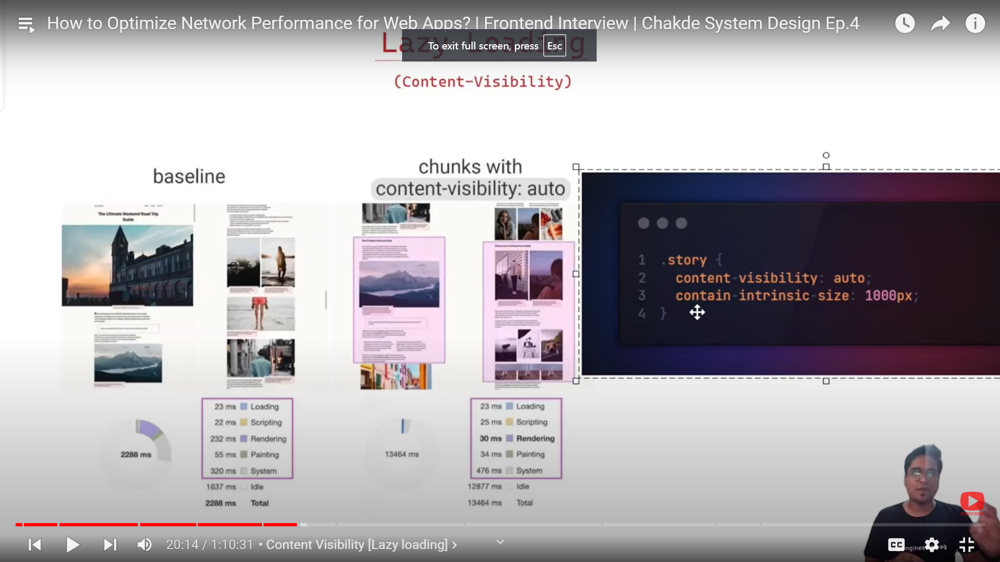
- Serving critical css
	- 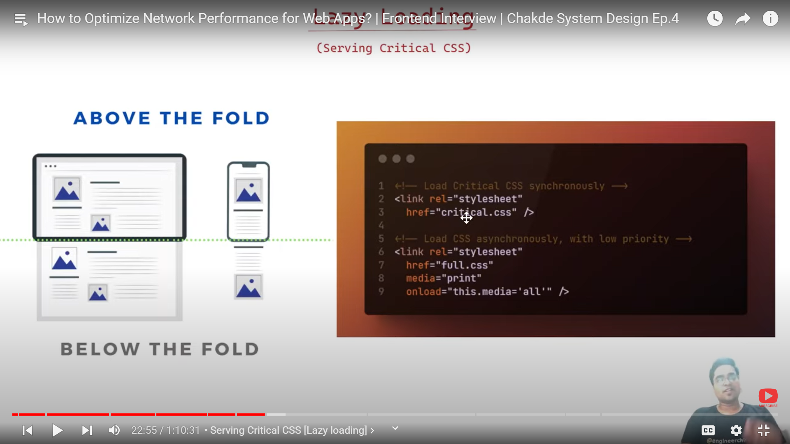
- Resource hints
	- 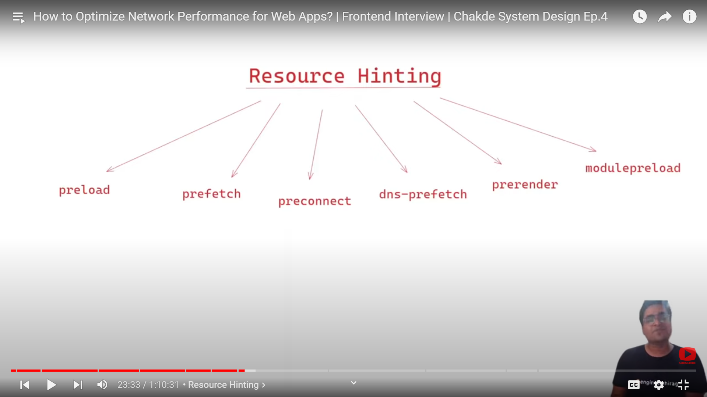
	- 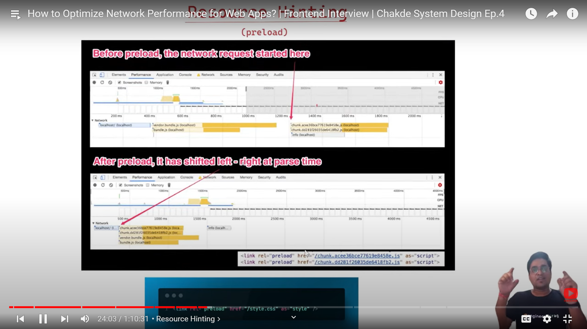
	- 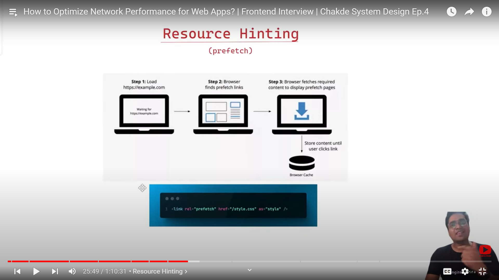
	- 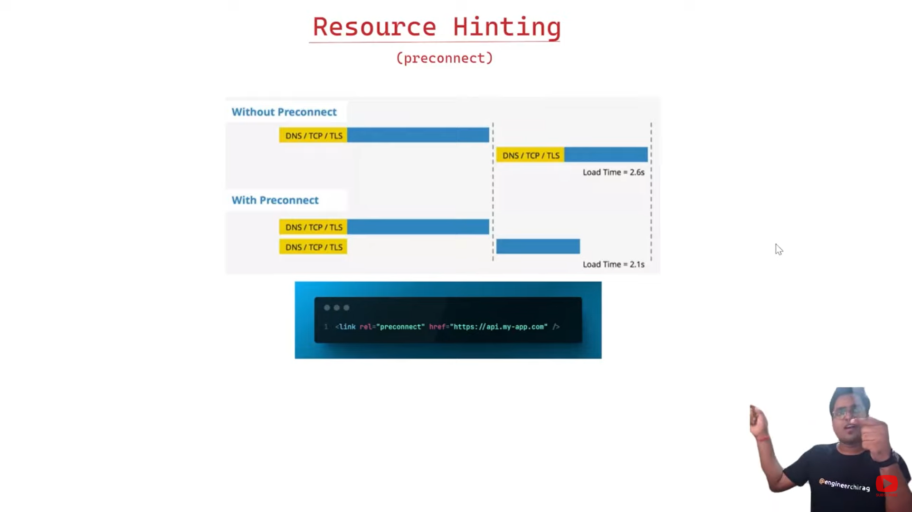
- Caching using service worker
	- 
- Caching using CDN
- CSR，SSR
	- 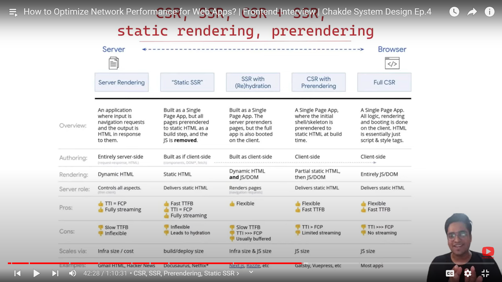
- Compression techniques
- -Layout shits & repaints
	- 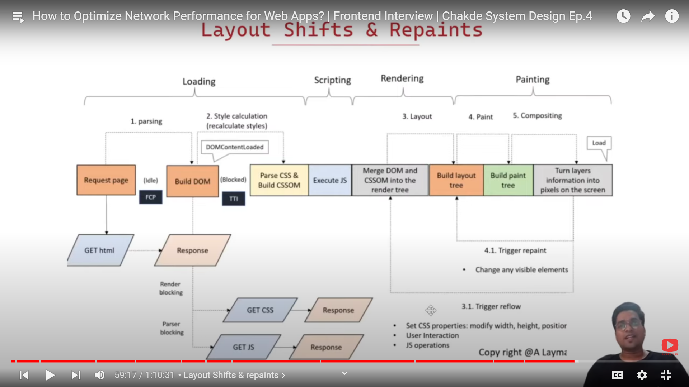
	- 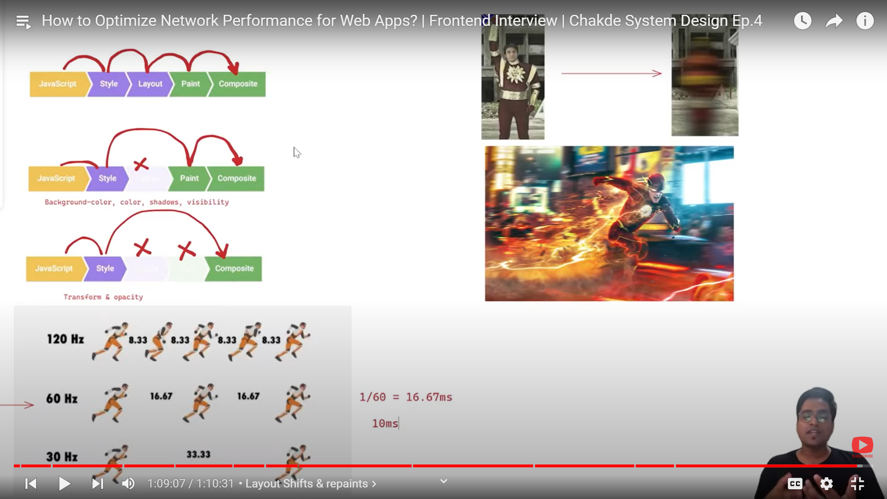

## assets
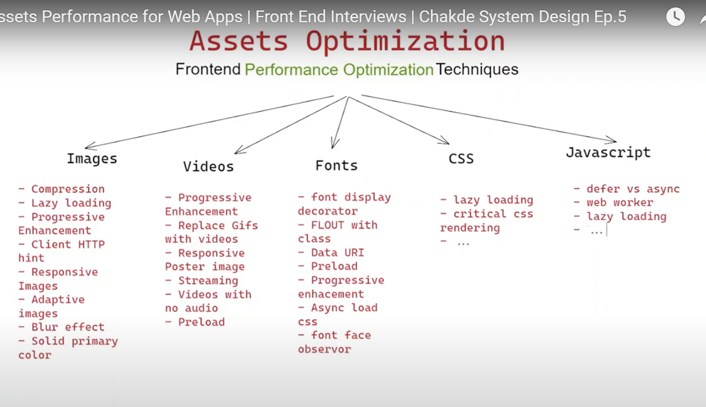
- images
	- compress
		- 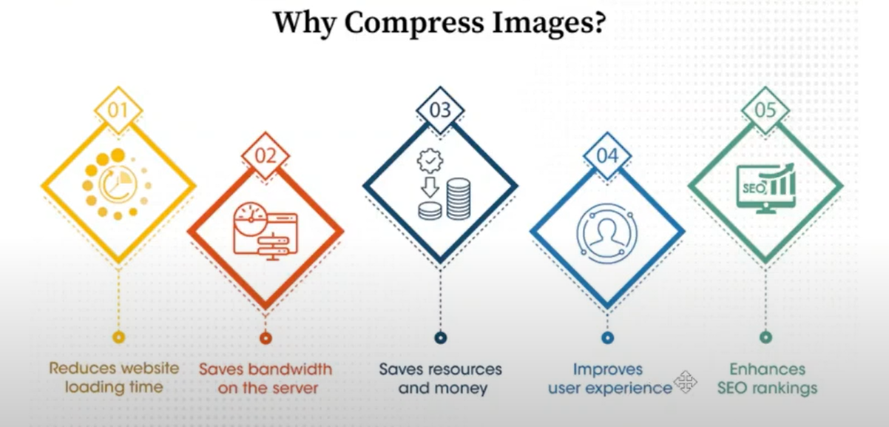
		- webp
			- 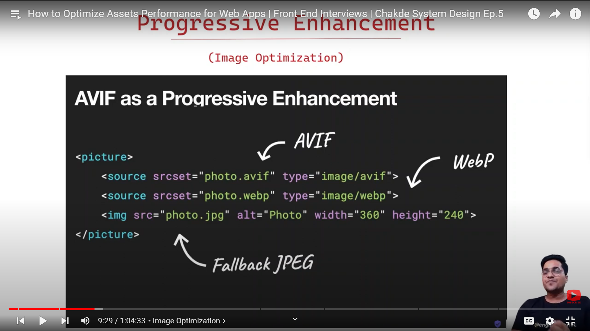
			- 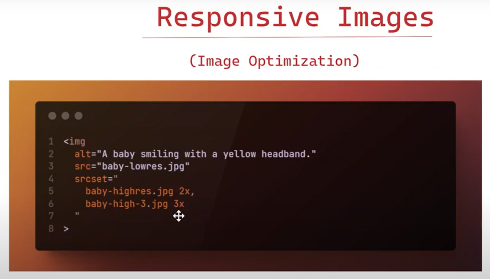
- video
- font
- css
- js
	- 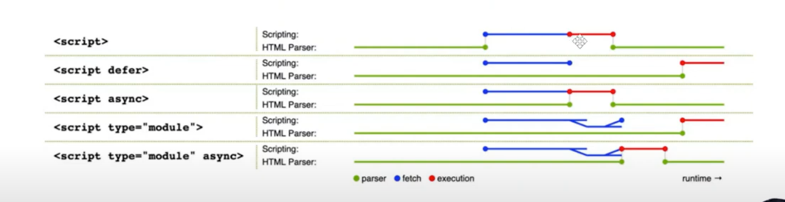