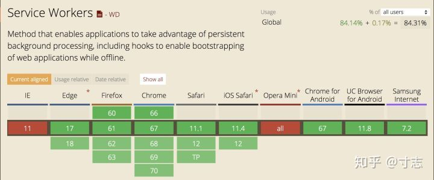
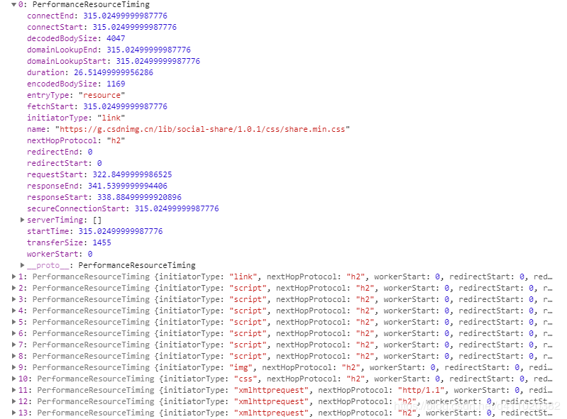

# monitor

## page crash

### 页面崩溃监控方案
- Service worker 是一个注册在指定源和路径下的事件驱动 worker，Service Worker 有自己独立的工作线程，与网页区分开，网页崩溃了
- Service Worker 一般情况下不会崩溃；Service Worker 生命周期一般要比网页还要长，可以用来监控网页的状态；
- 网页可以通过 navigator.serviceWorker.controller.postMessage API 向掌管自己的 SW 发送消息。

#### 基于以上几点，可以实现一种基于心跳检测的监控方案：

- p1：网页加载后，通过 postMessage API 每 5s 给 sw 发送一个心跳，表示自己的在线，sw 将在线的网页登记下来，更新登记时间；

- p2：网页在 beforeunload 时，通过 postMessage API 告知自己已经正常关闭，sw 将登记的网页清除；

- p3：如果网页在运行的过程中 crash 了，sw 中的 running 状态将不会被清除，更新时间停留在奔溃前的最后一次心跳；

- sw：Service Worker 每 10s 查看一遍登记中的网页，发现登记时间已经超出了一定时间（比如 15s）即可判定该网页 crash 了。

#### 项目的实现细节：
由于 sw 的限制，只能放在所需监控域名的目录下。即单个业务使用可以将 sw.js 文件放在 xxx 域名的根目录下来监控网页是否崩溃。如下图所示：

![[Pasted_image_20240812093220.png]](../images/Pasted_image_20240812093220.png)

> 注意：公共组件为了实现各个业务都能监控上报，不可能在 hawkEye.src.js 文件中去注册 sw ，假如这样去注册了只能监控资源域名的状态，这样是没有意义的。

#### 公共组件的实现细节：
在网页生成一个隐藏的 iframe，在 iframe 里注册 sw，之后网页直接通过 iframe 来通信。iframe 起到一个中转的作用。如下图所示：

![[Pasted_image_20240812093230.png]](../images/Pasted_image_20240812093230.png)

### 页面卡顿监控方案
要监控网页的卡顿，我们必须从 fps 说起。fps 是来自视频或者游戏里的概念，即是每秒的帧数，代表视频或者游戏的流畅度，俗话说，就是“不卡”。

> 那在前端开发领域，网页的 fps 是什么呢？

网页内容在不断变化之中，网页的 FPS 是只浏览器在渲染这些变化时的帧率。帧率越高，用户感觉网页越流畅，反之则会感觉卡顿。

在 Chrome 中可以通过开发者工具查看网页的 fps：

![[Pasted_image_20240812093243.png]](../images/Pasted_image_20240812093243.png)

注意，网页不是随时都需要，该工具看到的是每次更新是 fps 值。
最优的帧率是 60，即 16.7ms 左右渲染一次。

通过 Chrome 或者 Firfox 等的性能工具也可以查看浏览器的帧率：

![[Pasted_image_20240812093254.png]](../images/Pasted_image_20240812093254.png)

> 绿色的直方图即代表在页面重新绘制时的帧率，Frames 为每一帧渲染所花的时间。

#### 如何计算网页的 fps？
通过 requestAnimationFrame API 来定时执行一些 JS 代码，如果浏览器卡顿，无法很好地保证渲染的频率，1s 中 frame 无法达到 60 帧，即可间接地反映浏览器的渲染帧率。

	var lastTime = performance.now();
	var frame = 0;
	var lastFameTime = performance.now();
	var loop = function(time) {
		var now =  performance.now();
		var fs = (now - lastFameTime);
		lastFameTime = now;
		var fps = Math.round(1000/fs);
		frame++;
		if (now > 1000 + lastTime) {
			var fps = Math.round( ( frame * 1000 ) / ( now - lastTime ) );
			frame = 0;    
			lastTime = now;    
		};           
		window.requestAnimationFrame(loop);   
	}

#### 什么样的网页算卡顿？
我们收集连续 10s 内每秒的 fps ，如果页面有 4 个帧没有超过 30 fps, 我们认为这个页面是卡顿的。

## memory report

## 内存上报内存上报

1. `performance = {`  
2.      `// memory 是非标准属性，只在 Chrome 有`
3.      `//这个属性提供了一个可以获取到基本内存使用情况的对象`
4.      `memory: {`
5.          `usedJSHeapSize:  10000000, // 可使用的内存`
6.          `totalJSHeapSize: 10000000, // 内存大小限制`
7.          `jsHeapSizeLimit: 2190000000 // JS 对象（包括V8引擎内部对象）占用的内存`
8.      `},`
9. `}`

主要基于Chrome的 performance.memory 接口获取内存信息进行上报

### 接口分析接口分析

jsHeapSizeLimit 属性为整个浏览器占用内存，多个标签页公用

不同浏览器的内存数不一样

- chrome 4144M
- qq浏览器 1048M
- 360安全浏览器 2096M

因为这个值是根据浏览器固定的，所以不需要上报

totalJSHeapSize 和 usedJSHeapSize 分别是 可用内存 和 当前内存

经过测试，totalJSHeapSize是浏览器动态分配的，如果当前的 usedJSHeapSize 值接近 totalJSHeapSize值，浏览器就会增大totalJSHeapSize值。

所以内存导致奔溃存在两种情况

- 内存突然暴涨，导致usedJSHeapSize值 超过 totalJSHeapSize值
    
- 内存持续泄露，usedJSHeapSize缓慢增大，导致浏览器不断分配内存给 totalJSHeapSize。如果达到所有标签页的 totalJSHeapSize 加起来大于 jsHeapSizeLimit，就会导致整个浏览器奔溃
    

### 上报数据上报数据

根据以上分析分享，只上报内存使用占比无法反应出内存情况，需要同时上报内存占比和当前内存

- usedJSHeapSize / totalJSHeapSize
    
- usedJSHeapSize
    

## 奔溃上报奔溃上报

网页崩溃之后，JS 运行不了了，无法使用常规方法进行监控和上报。只能通过浏览器的特殊机制进行监控

### 基于 Service Worker 的崩溃统计方案基于 Service Worker 的崩溃统计方案

- Service worker是一个注册在指定源和路径下的事件驱动worker，Service Worker 有自己独立的工作线程，与网页区分开，网页崩溃了，Service Worker 一般情况下不会崩溃；
    
- Service Worker 生命周期一般要比网页还要长，可以用来监控网页的状态；
    
- 网页可以通过 navigator.serviceWorker.controller.postMessage API 向掌管自己的 SW 发送消息。
    

基于以上几点，可以实现一种基于心跳检测的监控方案：

- p1：网页加载后，通过 postMessage API 每 5s 给 sw 发送一个心跳，表示自己的在线，sw 将在线的网页登记下来，更新登记时间；
    
- p2：网页在 beforeunload 时，通过 postMessage API 告知自己已经正常关闭，sw 将登记的网页清除；
    
- p3：如果网页在运行的过程中 crash 了，sw 中的 running 状态将不会被清除，更新时间停留在奔溃前的最后一次心跳；
    
- sw：Service Worker 每 10s 查看一遍登记中的网页，发现登记时间已经超出了一定时间（比如 15s）即可判定该网页 crash 了。
    

### 兼容性兼容性

IE 和 Opera Mini 基本不支持， Edge 17以下不支持，Safair 和 IOS Safair 刚刚开始支持，而火狐和 Chrome 支持良好

### 上报数据上报数据

- 奔溃页面路径
    
- 页面内存 performance.memory
    
- 页面资源内存 performance.getEntriesByType()  
    performance.getEntriesByType() 方法可以获取页面相关资源（js、css、img…）的加载信息  

    
    我们只需用到以下几个信息
    
    1.   `// 资源的名称`
    2.   `name: item.name,`
    3.   `// 资源内存大小`
    4.   `size: item.transferSize`