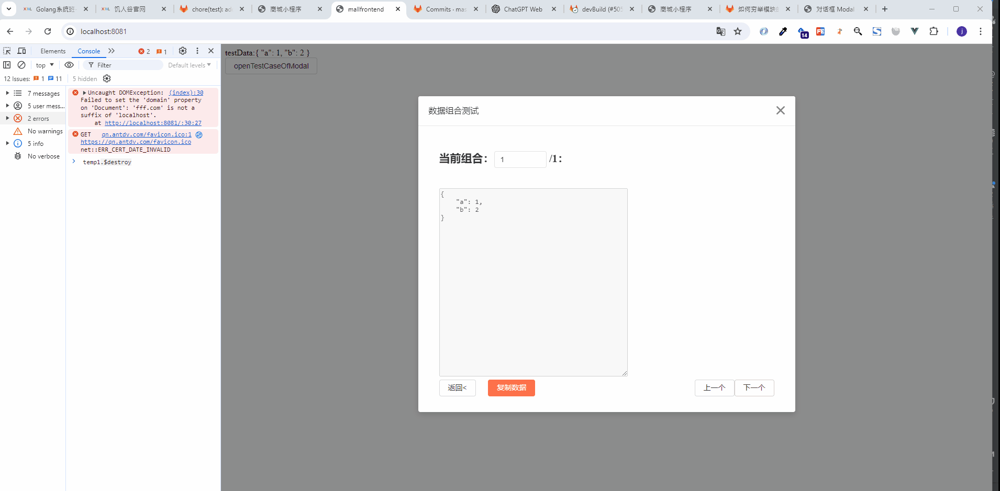
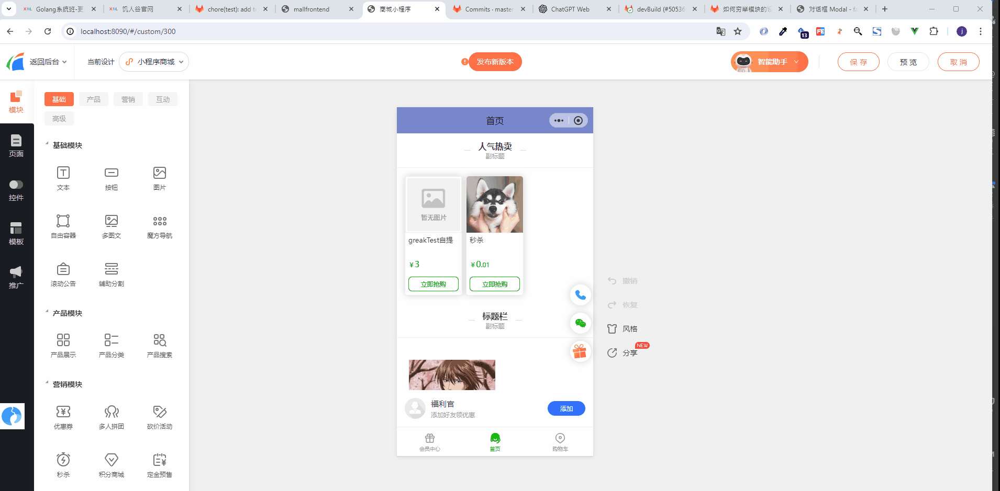

# 测试

## 背景介绍

日常开发中如何去保证代码质量，我们可能有如下几种方式：
- 手工点点点
- 通过代码去测试代码，有且不限于
  - 单元测试
  - 集成测试
  - 自动化测试
  - 其他的一些方式

## 前端项目在使用的测试

- @mall/kit：工具函数引入jest做单元测试，验证入参和出参

## 当提交代码触发ci失败时，应当如何处理？

- 首先大概率是你的问题，因为前人是通过了case的。
- 先不要上来就去问测试用例的开发者要怎么处理，尝试自己解决。
- 先自行看下错误报告，看下你改动的方法为什么会失败。
- 大部分情况下不允许注释，跳过用例，因为出错说明其他的业务调用处也会跟着出错。

## 界面测试

假设我们有一个数据如下：
```javascript
var testData = {
    "a": 1, //取值范围：[1,2,3]
    "b": 4, //取值范围：[4, 5, 6]
}
```
a有3种可能，b有3种可能，这里就有3x3=9种组合。如果你手动点点，那么就需要修改9次数据看表现，我们也可以通过@mall/kit提供`openTestCaseOfModal`，通过弹窗流程生成测试数据，
```javascript
import { openTestCaseOfModal } from "@mall/kit";
openTestCaseOfModal({
    data: this.testData, dataDef: {
        a: [1, 2,3],
        b: [4, 5, 6]
    },
    change: (data)=>{
        this.testData = deepAssign( {}, this.testData, data );
    }
})
```
测试表现：



目前再以一个mallapp-res的产品展示模块测试为例，我们会有如下的数据格式：
```javascript
let moduleData = {
    content: {
        s: 1,//0-5
        ct: 2,//0-2
    },
    pattern: {}
}
```
s有6种可能，ct有3种可能，这里就有18种组合。如果你手动点点，那么就需要添加18次模块看表现，我们也可以通过@mall/kit提供`openTestCaseOfModal`，通过弹窗流程生成测试数据，
```javascript
import { openTestCaseOfModal } from "@mall/kit";
openTestCaseOfModal({
    data: moduleData,
    dataDef: {  },
    change: (newModule)=>{
        //弹窗里面切换的用例数据，他的格式传入的moduleData是一样的，你可以在这里做this.$set之类的操作来让数据生效
        deepAssign(moduleData, newModule)
    },
    propsOfModal: {
        wrapClassName: "f_left",
        width: 540,
        footer: null,
    }
});
```
效果详见：


更多openTestCaseOfModal的详细用法，详见[传送门](http://mafe.fff.com/kit/global.html#openTestCaseOfModal)